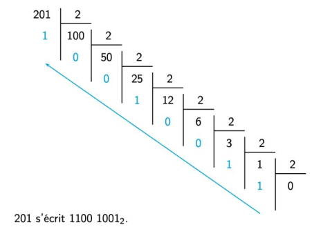

# Sujet_01

## s_1.1

Dans cet exercice, un arbre binaire de caractères est stocké sous la forme d’un
dictionnaire où les clefs sont les caractères des nœuds de l’arbre et les valeurs, pour
chaque clef, la liste des caractères des fils gauche et droit du nœud.

On utilise la valeur `''` pour représenter un fils vide.

Par exemple, l’arbre


est stocké dans

```python
a = {'F':['B','G'], 'B':['A','D'], 'A':['',''], 'D':['C','E'], \
'C':['',''], 'E':['',''], 'G':['','I'], 'I':['','H'], \
'H':['','']}

# Votre code
def taille(dictionnaire):
    pass
```

Écrire une fonction récursive `taille` prenant en paramètres un arbre binaire `arbre` non vide
sous la forme d’un dictionnaire et un caractère `lettre` qui est la valeur du sommet de
l’arbre, et qui renvoie la taille de l’arbre à savoir le nombre total de nœuds.

On observe que, par exemple, `arbre[lettre][0]`, respectivement
`arbre[lettre][1]`, permet d’atteindre la clé du sous-arbre gauche, respectivement
droit, de l’arbre `arbre` de sommet `lettre`.

Exemple :
```python
assert taille(a, 'F')==9
assert taille(a, 'B')==5
assert taille(a, 'I')==2
```

## s_1.2

On considère l'algorithme de tri de tableau suivant : à chaque étape, on parcourt le sous-
tableau des éléments non rangés et on place le plus petit élément en première position de
ce sous-tableau.

Exemple avec le tableau : ```t = [41, 55, 21, 18, 12, 6, 25]``` 

- Étape 1 : on parcourt tous les éléments du tableau, on permute le plus petit élément avec
le premier. Le tableau devient `t = [6, 55, 21, 18, 12, 41, 25]`

- Étape 2 : on parcourt tous les éléments **sauf le premier**, on permute le plus petit élément
trouvé avec le second.  
Le tableau devient : ```t = [6, 12, 21, 18, 55, 41, 25]``` 

Et ainsi de suite. 

Le programme ci-dessous implémente cet algorithme.


```python
def echange(tab, i, j):
    '''Echange les éléments d'indice i et j dans le tableau tab.'''
    temp = ... 
    tab[i] = ... 
    tab[j] = ... 

def tri_selection(tab):
    '''Trie le tableau tab dans l'ordre croissant
    par la méthode du tri par sélection.'''
    N = len(tab)
    for k in range(...): 
        imin = ... 
        for i in range(..., N): 
            if tab[i] < ...: 
                imin = i
        echange(tab, ..., ...)
    return tab
```

Compléter le code de cette fonction de façon à obtenir :

```python
assert tri_selection([41, 55, 21, 18, 12, 6, 25])==[6, 12, 18, 21, 25, 41, 55]
```

# Sujet_02
## s_2.1

On considère des chaînes de caractères contenant uniquement des majuscules et des caractères `*` appelées *mots à trous*.

Par exemple `INFO*MA*IQUE`, `***I***E**` et `*S*` sont des mots à trous.

Programmer une fonction `correspond` qui :

- prend en paramètres deux chaînes de caractères `mot` et `mot_a_trous` où `mot_a_trous` est un mot à trous comme indiqué ci-dessus, 
- renvoie :
    - `True` si on peut obtenir `mot` en remplaçant convenablement les caractères `'*'` de `mot_a_trous`.
    - `False` sinon.

```python
def correspond(a,b):
    pass
```


Exemple :

```python
assert correspond('INFORMATIQUE', 'INFO*MA*IQUE')==True
assert correspond('AUTOMATIQUE', 'INFO*MA*IQUE')==False
assert correspond('STOP', 'S*')==False
assert correspond('AUTO', '*UT*')==True
```

## s_2.2

On considère au plus 26 personnes A, B, C, D, E, F ... qui peuvent s'envoyer des messages
avec deux règles à respecter :

- chaque personne ne peut envoyer des messages qu'à une seule personne
(éventuellement elle-même),
- chaque personne ne peut recevoir des messages qu'en provenance d'une seule
personne (éventuellement elle-même).


Voici un exemple - avec 6 personnes - de « plan d'envoi des messages » qui respecte les
règles ci-dessus, puisque chaque personne est présente une seule fois dans chaque
colonne :

- A envoie ses messages à E
- E envoie ses messages à B
- B envoie ses messages à F
- F envoie ses messages à A
- C envoie ses messages à D
- D envoie ses messages à C

Et le dictionnaire correspondant à ce plan d'envoi est le suivant :

`plan_a = {'A':'E', 'B':'F', 'C':'D', 'D':'C', 'E':'B', 'F':'A'}`

Un cycle est une suite de personnes dans laquelle la dernière est la même que la
première.

Sur le plan d'envoi `plan_a` des messages ci-dessus, il y a deux cycles distincts : un premier
cycle avec A, E, B, F et un second cycle avec C et D.

En revanche, le plan d’envoi `plan_b` ci-dessous :

`plan_b = {'A':'C', 'B':'F', 'C':'E', 'D':'A', 'E':'B', 'F':'D'}`

comporte un unique cycle : A, C, E, B, F, D. Dans ce cas, lorsqu’un plan d’envoi comporte un
*unique cycle*, on dit que le plan d’envoi est *cyclique*.

Pour savoir si un plan d'envoi de messages comportant N personnes est cyclique, on peut
utiliser l'algorithme ci-dessous :


- on part d’un expéditeur (ici A) et on inspecte son destinataire dans le plan d'envoi,
- chaque destinataire devient à son tour expéditeur, selon le plan d’envoi, tant
qu’on ne « retombe » pas sur l’expéditeur initial,
- le plan d’envoi est cyclique si on l’a parcouru en entier.


Compléter la fonction `est_cyclique` en respectant la spécification.

On rappelle que la fonction Python `len` permet d'obtenir la longueur d'un dictionnaire.


```python
def est_cyclique(plan):
    '''Prend en paramètre un dictionnaire `plan` correspondant à 
    un plan d'envoi de messages (ici entre les personnes A, B, C,
    D, E, F).
    Renvoie True si le plan d'envoi de messages est cyclique et 
    False sinon.'''
    expediteur = 'A'
    destinataire = plan[...] 
    nb_destinataires = 1

    while destinataire != expediteur:
        destinataire = ... 
        nb_destinataires = ... 

    return nb_destinataires == ...
```

Exemples :

```python
assert est_cyclique({'A':'E', 'F':'A', 'C':'D', 'E':'B', 'B':'F', 'D':'C'})==False
assert est_cyclique({'A':'E', 'F':'C', 'C':'D', 'E':'B', 'B':'F', 'D':'A'})==True
assert est_cyclique({'A':'B', 'F':'C', 'C':'D', 'E':'A', 'B':'F', 'D':'E'})==True
assert est_cyclique({'A':'B', 'F':'A', 'C':'D', 'E':'C', 'B':'F', 'D':'E'})==False
```

# Sujet_03
## S_3.1

Écrire la fonction `maximum_tableau`, prenant en paramètre un tableau non vide de nombres `tab` (de type
`list`) et renvoyant le plus grand élément de ce tableau.

```python
def maximum_tableau(a):
    pass
```


Exemples :

```python
assert maximum_tableau([98, 12, 104, 23, 131, 9])==131
assert maximum_tableau([-27, 24, -3, 15])==24
```

## S_3.2

On dispose de chaînes de caractères contenant uniquement des parenthèses ouvrantes et fermantes. 

Un parenthésage est correct si :

- le nombre de parenthèses ouvrantes de la chaîne est égal au nombre de parenthèses fermantes.
- en parcourant la chaîne de gauche à droite, le nombre de parenthèses déjà ouvertes doit être, à tout moment, supérieur ou égal au nombre de parenthèses déjà fermées.


Ainsi, `((()())(()))` est un parenthésage correct. 

Les parenthésages `())(()` et `(())(()` sont, eux, incorrects.


On dispose du code de la classe `Pile` suivant :

```python
class Pile:
    """Classe définissant une structure de pile."""
    def __init__(self):
        self.contenu = []

    def est_vide(self):
        """Renvoie un booléen indiquant si la pile est vide."""
        return self.contenu == []

    def empiler(self, v):
        """Place l'élément v au sommet de la pile"""
        self.contenu.append(v)

    def depiler(self):
        """
        Retire et renvoie l'élément placé au sommet de la pile,
        si la pile n’est pas vide. Produit une erreur sinon.
        """
        assert not self.est_vide()
        return self.contenu.pop()
```

On souhaite programmer une fonction bon_parenthesage qui prend en paramètre une chaîne de caractères ch formée de parenthèses et renvoie True si la chaîne est bien parenthésée et False sinon.

Cette fonction utilise une pile et suit le principe suivant : en parcourant la chaîne de gauche à droite, si on trouve une parenthèse ouvrante, on l’empile au sommet de la pile et si on trouve une parenthèse fermante, on dépile (si possible) la parenthèse ouvrante stockée au sommet de la pile.

La chaîne est alors bien parenthésée si, à la fin du parcours, la pile est vide.

Elle est, par contre, mal parenthésée :

si dans le parcours, on trouve une parenthèse fermante, alors que la pile est vide ;
ou si, à la fin du parcours, la pile n’est pas vide.
Compléter le code de la fonction bon_parenthesage ci-dessous:

```python
def bon_parenthesage(ch):
    """Renvoie un booléen indiquant si la chaîne ch 
    est bien parenthésée"""
    p = Pile()
    for c in ch:
        if c == ...: 
            p.empiler(c)
        elif c == ...: 
            if p.est_vide():
                ...
            else:
                ...
    return ...
```

Exemples :

```python
assert bon_parenthesage("((()())(()))")==True
assert bon_parenthesage("())(()")==False
assert bon_parenthesage("(())(()")==False
```

# Sujet_04
## S_4.1

Programmer la fonction `recherche`, prenant en paramètres un tableau non vide `tab` (type `list`) d'entiers et un entier `n`, et qui renvoie l'indice de la **dernière** occurrence de l'élément cherché. Si l'élément n'est pas présent, la fonction renvoie `None`.

```python
def recherche(a):
    pass
```


Exemples
```python
assert recherche([5, 3], 1)==None # renvoie None
assert recherche([2, 4], 2)==0
assert recherche([2, 3, 5, 2, 4], 2)==3
```

## S_4.2

On souhaite programmer une fonction donnant la distance la plus courte entre un point
de départ et une liste de points. Les points sont tous à coordonnées entières.
Les points sont donnés sous la forme d'un tuple de deux entiers.
La liste des points à traiter est donc un tableau de tuples.

On rappelle que la distance entre deux points du plan de coordonnées $(x;y)$ et $(x';y')$
vérifie la formule :

$$d^2=(x-x')^2+(y-y')^2$$


Compléter le code des fonctions `distance_carre` et `point_le_plus_proche` fournies ci-dessous pour qu’elles répondent à leurs spécifications.

```python
def distance_carre(point1, point2):
    """ Calcule et renvoie la distance au carre entre 
    deux points."""
    return (...)**2 + (...)**2 

def point_le_plus_proche(depart, tab):
    """ Renvoie les coordonnées du premier point du tableau tab se 
    trouvant à la plus courte distance du point depart."""
    min_point = tab[0]
    min_dist = ... 
    for i in range(1, len(tab)):
        if distance_carre(tab[i], depart) < ...: 
            min_point = ... 
            min_dist = ... 
    return min_point
```

Exemples :

```python
assert distance_carre((1, 0), (5, 3))==25
assert distance_carre((1, 0), (0, 1))==2
assert point_le_plus_proche((0, 0), [(7, 9), (2, 5), (5, 2)])==(2, 5)
assert point_le_plus_proche((5, 2), [(7, 9), (2, 5), (5, 2)])==(5, 2)
```

# Sujet_05
## S_5.1

Écrire une fonction `max_et_indice` qui prend en paramètre un tableau non vide `tab` de
nombres entiers et qui renvoie la valeur du plus grand élément de ce tableau ainsi que
l’indice de sa première apparition dans ce tableau.

L’utilisation de la fonction native `max` n’est pas autorisée.

```python
def max_et_indice(a):
    pass
```

Exemples :

```python
assert max_et_indice([1, 5, 6, 9, 1, 2, 3, 7, 9, 8])==(9, 3)
assert max_et_indice([-2])==(-2, 0)
assert max_et_indice([-1, -1, 3, 3, 3])==(3, 2)
assert max_et_indice([1, 1, 1, 1])==(1, 0)
```

## S_5.2

L’ordre des gènes sur un chromosome est représenté par un tableau `ordre` de `n` cases
d’entiers distincts deux à deux et compris entre 1 et `n`.

Par exemple, `ordre = [5, 4, 3, 6, 7, 2, 1, 8, 9]` dans le cas `n = 9`.

On dit qu’il y a un point de rupture dans `ordre` dans chacune des situations suivantes :

- la première valeur de `ordre` n’est pas 1 ;
- l’écart entre deux gènes consécutifs n’est pas égal à 1 ;
- la dernière valeur de `ordre` n’est pas n.

Par exemple, si `ordre = [5, 4, 3, 6, 7, 2, 1, 8, 9]` avec `n = 9`, on a

- un point de rupture au début car 5 est différent de 1
- un point de rupture entre 3 et 6 (l’écart est de 3)
- un point de rupture entre 7 et 2 (l’écart est de 5)
- un point de rupture entre 1 et 8 (l’écart est de 7)

Il y a donc 4 points de rupture.

Compléter les fonctions Python `est_un_ordre` et `nombre_points_rupture`
proposées à la page suivante pour que :


- la fonction `est_un_ordre` renvoie `True` si le tableau passé en paramètre représente bien un ordre de gènes de chromosome et `False` sinon ;

- la fonction `nombre_points_rupture` renvoie le nombre de points de rupture d’un tableau passé en paramètre représentant l’ordre de gènes d’un chromosome.

```python
def est_un_ordre(tab):
    '''
    Renvoie True si tab est de longueur n et contient tous les
    entiers de 1 à n, False sinon
    '''
    n = len(tab)
    # les entiers vus lors du parcours
    vus = ... 

    for x in tab:
        if x < ... or x >... or ...: 
            return False
        ... .append(...) 
    return True

def nombre_points_rupture(ordre):
    '''
    Renvoie le nombre de point de rupture de ordre qui représente 
    un ordre de gènes de chromosome
    '''
    # on vérifie que ordre est un ordre de gènes
    assert ... 
    n = len(ordre)
    nb = 0
    if ordre[...] != 1: # le premier n'est pas 1 
        nb = nb + 1
    i = 0
    while i < ...: 
        if ... not in [-1, 1]: # l'écart n'est pas 1 
            nb = nb + 1
        i = i + 1
    if ordre[i] != ...: # le dernier n'est pas n 
        nb = nb + 1
    return nb
```

Exemples :

```python
assert est_un_ordre([1, 6, 2, 8, 3, 7])==False
assert est_un_ordre([5, 4, 3, 6, 7, 2, 1, 8, 9])==True
assert nombre_points_rupture([5, 4, 3, 6, 7, 2, 1, 8, 9])==4
assert nombre_points_rupture([1, 2, 3, 4, 5])==0
assert nombre_points_rupture([1, 6, 2, 8, 3, 7, 4, 5])==7
assert nombre_points_rupture([2, 1, 3, 4])==2
```

# Sujet_06
## S_6.1

Écrire une fonction `verifie` qui prend en paramètre un tableau de valeurs numériques et qui renvoie `True` si ce tableau est trié dans l’ordre croissant, `False` sinon.

Un tableau vide est considéré comme trié.

```python
def verifie(a):
    pass
```


Exemples :

```python
assert verifie([0, 5, 8, 8, 9])==True
assert verifie([8, 12, 4])==False
assert verifie([-1, 4])==True
assert verifie([])==True
assert verifie([5])==True
```

## S_6.2

On considère dans cet exercice l’élection d’un vainqueur à l’issue d’un vote. Les résultats
du vote sont stockés dans un tableau : chaque vote exprimé est le nom d’un ou d’une candidate.  

Par exemple, les résultats pourraient correspondre au tableau :

```python
urne = ['A', 'A', 'A', 'B', 'C', 'B', 'C', 'B', 'C', 'B']
```

indiquant que 3 candidats ont obtenu au moins un vote chacun : A, B et C.

On cherche à déterminer le ou les candidats ayant obtenu le plus de suffrages. Pour cela, on propose d’écrire deux fonctions :

- La fonction depouille doit permettre de compter le nombre de votes exprimés pour chaque artiste. Elle prend en paramètre un tableau et renvoie le résultat dans un dictionnaire dont les clés sont les noms des issues et les valeurs le nombre de votes en leur faveur.
- La fonction vainqueurs doit désigner le nom du ou des gagnants. Elle prend en paramètre un dictionnaire non vide dont la structure est celle du dictionnaire renvoyé par la fonction depouille et renvoie un tableau. Ce tableau peut donc contenir plusieurs éléments s’il y a des artistes ex- aequo. Compléter les fonctions depouille et vainqueurs ci-après pour qu’elles renvoient les résultats attendus.

```python
def depouille(urne):
    '''prend en paramètre une liste de suffrages et renvoie un 
    dictionnaire avec le nombre de voix pour chaque candidat'''
    resultat = ... 
    for bulletin in urne:
        if ...: 
            resultat[bulletin] = resultat[bulletin] + 1
        else:
            ...
    return resultat

def vainqueurs(election):
    '''prend en paramètre un dictionnaire non vide avec le nombre de voix
    pour chaque candidat et renvoie la liste des vainqueurs'''
    nmax = 0
    for candidat in election:
        if ... > ... : 
            nmax = ... 
    liste_finale = [ nom for nom in election if ... ] 
    return ...
```

Exemples d’utilisation :

```python
assert depouille([ 'A', 'B', 'A' ])=={'A': 2, 'B': 1}
assert depouille([])=={}
assert depouille(['A', 'A', 'A', 'B', 'C','B', 'C', 'B', 'C', 'B'])=={'A': 3, 'B': 4, 'C': 3}
assert vainqueurs({'A': 3, 'B': 4, 'C': 3})==['B']
assert vainqueurs({ 'A' : 2, 'B' : 2, 'C' : 1})==['A', 'B']
```

# Sujet_07
## S_7.1

On considère dans cet exercice une représentation binaire d’un entier non signé en tant que
tableau de booléens.
Si

```python
tab = [True, False, True, False, False, True, True]
```

est un tel tableau, alors l’entier qu’il représente est $2^6 +2^4 + 2^1 + 2^0 = 83$. Cette représentation consistant à placer en premier le booléen indiquant la puissance la plus élevée de 2
est dite *big-endian* ou grand-boutiste.

Écrire une fonction `gb_vers_entier` qui prend en paramètre un tel tableau et renvoie l’entier qu’il représente.

```python
def gb_vers_entier(a):
    pass
```


Exemple :

```python
assert gb_vers_entier([])==0
assert gb_vers_entier([True])==1
assert gb_vers_entier([True, False, True, False, False, True, True])==83
assert gb_vers_entier([True, False, False, False, False, False, True, False])==130
```

## S_7.2

La fonction `tri_insertion` suivante prend en argument un tableau `tab` et trie ce tableau en utilisant la méthode du tri par insertion. Compléter cette fonction pour qu'elle réponde à la spécification demandée.

On rappelle le principe du tri par insertion : on considère les éléments à trier un par un,le premier élément constituant, à lui tout seul, un tableau trié de longueur 1. On range ensuite le second élément pour constituer un tableau trié de longueur 2, puis on range le troisième élément pour avoir un tableau trié de longueur 3 et ainsi de suite...

A chaque étape, le premier élément du sous-tableau non trié est placé dans le sous-tableau des éléments déjà triés de sorte que ce sous-tableau demeure trié.

Le principe du tri par insertion est donc d'insérer à la n-ième itération, le n-ième élément à la bonne place.


```python
def tri_insertion(tab):
    '''Trie le tableau tab par ordre croissant
    en appliquant l'algorithme de tri par insertion'''
    n = len(tab)
    for i in range(1, n):
        valeur_insertion = ... 
        # la variable j sert à déterminer 
        # où placer la valeur à ranger
        j = ... 
        # tant qu'on n'a pas trouvé la place de l'élément à
        # insérer on décale les valeurs du tableau vers la droite
        while j > ... and valeur_insertion < tab[...]: 
            tab[j] = tab[j-1]
            j = ... 
        tab[j] = ...
    return tab
```

Exemples :

```python
assert tri_insertion([98, 12, 104, 23, 131, 9])==[9, 12, 23, 98, 104, 131]
```

# Sujet_08
## S_8.1

Le codage par différence (*delta encoding* en anglais) permet de compresser un tableau
d’entiers dont les valeurs sont proches les unes des autres. Le principe est de stocker la
première donnée en indiquant pour chaque autre donnée sa différence avec la précédente
plutôt que la donnée elle-même.

On se retrouve alors avec un tableau de données plus petit, nécessitant
moins de place en mémoire. Cette méthode se révèle efficace lorsque les valeurs consécutives
sont proches.

Programmer la fonction `delta(liste)` qui prend en paramètre un tableau non vide de nombres entiers
et qui renvoie un tableau contenant les valeurs entières compressées à l’aide cette technique.

```python
def delta(a):
    pass
```


Exemples :

```python
assert delta([1000, 800, 802, 1000, 1003])==[1000, -200, 2, 198, 3]
assert delta([42])==[42] 
```

## S_8.2

Une expression arithmétique ne comportant que les quatre opérations +, −, ×, ÷ peut être
représentée sous forme d’arbre binaire. Les nœuds internes sont des opérateurs et les feuilles
sont des nombres. Dans un tel arbre, la disposition des nœuds joue le rôle des parenthèses que
nous connaissons bien.  


En parcourant en profondeur infixe l’arbre binaire ci-dessus, on retrouve l’expression notée habituellement :  


$$(3 \times (8 + 7)) − (2 + 1)$$


La classe `Expr` ci-après permet d’implémenter une structure d’arbre binaire pour représenter de telles expressions.

Compléter la méthode récursive `infixe` qui renvoie une chaîne de caractères contenant des parenthèses représentant l’expression arithmétique sur laquelle on l’applique.


```python
class Expr:
    """Classe implémentant un arbre d'expression."""

    def __init__(self, g, v, d):
        """un objet Expr possède 3 attributs :
        - gauche : la sous-expression gauche ;
        - valeur : la valeur de l'étiquette, opérande ou nombre ;
        - droite : la sous-expression droite."""
        self.gauche = g
        self.valeur = v
        self.droite = d

    def est_une_feuille(self):
        """renvoie True si et seulement 
        si le noeud est une feuille"""
        return self.gauche is None and self.droite is None

    def infixe(self):
        """renvoie la représentation infixe de l'expression en
        chaine de caractères"""
        s = ... 
        if self.gauche is not None:
            s = '(' + s + ... .infixe() 
        s = s + ... 
        if ... is not None: 
            s = s + ... + ... 
        return s
```

Exemples :

```python
a = Expr(Expr(None, 1, None), '+', Expr(None, 2, None))
assert a.infixe()=='(1+2)'
b = Expr(Expr(Expr(None, 1, None), '+', Expr(None, 2, None)), '*', Expr(Expr(None, 3, None), '+', Expr(None, 4, None)))
assert b.infixe()=='((1+2)*(3+4))'
e = Expr(Expr(Expr(None, 3, None), '*', Expr(Expr(None, 8, None), '+', Expr(None, 7, None))),'-', Expr(Expr(None, 2, None), '+', Expr(None, 1, None)))
assert e.infixe()=='((3*(8+7))-(2+1))'
```

# Sujet_09
## S_9.1

On veut trier par ordre croissant les notes d’une évaluation qui sont des nombres entiers compris entre 0 et 10 (inclus).

Ces notes sont contenues dans un tableau `notes_eval` (type `list`)

Écrire une fonction `effectif_notes` prenant en paramètre le tableau `notes_eval` et renvoyant un tableau de longueur 11 tel que la valeur d’indice `i` soit le nombre de notes valant `i` dans le tableau `notes_eval`.

Écrire ensuite une fonction `notes_triees` prenant en paramètre le tableau des effectifs des notes et renvoyant un tableau contenant les mêmes valeurs que `notes_eval` mais triées dans l’ordre croissant.

```python
def effectif_notes(a):
    pass

def notes_triees(b):
    pass
```


Exemple :

```python
notes_eval = [2, 0, 5, 9, 6, 9, 10, 5, 7, 9, 9, 5, 0, 9, 6, 5, 4]
assert effectif_notes(notes_eval)==[2, 0, 1, 0, 1, 4, 2, 1, 0, 5, 1]
assert notes_triees([2, 0, 1, 0, 1, 4, 2, 1, 0, 5, 1])==[0, 0, 2, 4, 5, 5, 5, 5, 6, 6, 7, 9, 9, 9, 9, 9, 10]
```

## S_9.2

L’objectif de cet exercice est d’écrire deux fonctions récursives `dec_to_bin` et `bin_to_dec` assurant respectivement la conversion de l’écriture décimale d’un nombre entier vers son écriture en binaire et, réciproquement, la conversion de l’écriture en binaire d’un nombre vers son écriture décimale.

Dans cet exercice, on s’interdit l’usage des fonctions Python `bin` et `int`.

L'exemple suivant montre comment obtenir l’écriture en binaire du
nombre 25 :

$25 =  2 \times 12 + 1$  
$\phantom{25} = 2 \times (2 \times 6 + 0) + 1$  
$\phantom{25} = 2 \times (2 \times (2 \times 3 + 0) + 0) + 1$  
$\phantom{25} = 2 \times (2 \times (2 \times (2 \times 1+1) + 0) + 0) + 1$     
$\phantom{25} = 2 \times (2 \times (2 \times (2 \times (2 \times 0 + 1)+1) + 0) + 0) + 1$   
$\phantom{25} = 1 \times 2^4 + 1 \times 2^3 + 0 \times 2^2 + 0 \times 2^1 + 1 \times 2^0$   

L'écriture binaire de 25 est donc ```11001```.

0n rappelle également que :

- `a // 2` renvoie le quotient de la division euclidienne de `a` par 2.
- ` a % 2` renvoie le reste dans la division euclidienne de `a` par 2.

On indique enfin qu’en Python si `mot = "informatique"` alors :

- `mot[-1]` renvoie `'e'`, c’est-à-dire le dernier caractère de la chaîne de caractères `mot`.
- `mot[:-1]` renvoie `'informatiqu'` , c’est-à-dire l’ensemble de la chaîne de
caractères `mot` privée de son dernier caractère.

Compléter, puis tester, les codes de deux fonctions ci-dessous. 
On précise que la fonction récursive `dec_to_bin` prend en paramètre un nombre entier et renvoie une chaîne de caractères contenant l’écriture en binaire du nombre passé en paramètre.

```python
def dec_to_bin(nb_dec):
    q, r = nb_dec // 2, nb_dec % 2
    if q == ...: 
        return ... 
    else:
        return dec_to_bin(...) + ... 

def bin_to_dec(nb_bin):
    if len(nb_bin) == 1:
        if ... == '0': 
            return 0
        else:
            return ... 
    else:
        if nb_bin[-1] == '0':
            bit_droit = 0
        else:
            ...
        return ... * bin_to_dec(nb_bin[:-1]) + ...
```


Exemple :

```python
assert dec_to_bin(25)=='11001'
```

La fonction récursive bin_to_dec prend en paramètre une chaîne de caractères représentant l’écriture d’un nombre en binaire et renvoie l’écriture décimale de ce nombre.

```python
assert bin_to_dec('101010')==42
```

# Sujet_10
## S_10.1

Dans cet exercice on cherche à calculer la moyenne pondérée d’un élève dans une matière donnée. Chaque note est associée à un coefficient qui la pondère.

Par exemple, si ses notes sont : 14 avec coefficient 3, 12 avec coefficient 1 et 16 avec coefficient 2, sa moyenne pondérée sera donnée par

$$\dfrac{14 \times 3 + 12 \times 1 + 16 \times 2}{3+1+2}=14,333... $$

Écrire une fonction `moyenne` :

- qui prend en paramètre une liste notes non vide de tuples à deux éléments entiers de la forme `(note, coefficient)` (`int` ou `float`) positifs ou nuls ;
- et qui renvoie la moyenne pondérée des notes de la liste sous forme de flottant si la somme des coefficients est non nulle, `None` sinon.

```python
def moyenne(a):
    pass
```


Exemple :

```python
assert moyenne([(8, 2), (12, 0), (13.5, 1), (5, 0.5)])==9.142857142857142
assert moyenne([(3, 0), (5, 0)])==None
```

## S_10.2


On travaille sur des dessins en noir et blanc obtenus à partir de pixels noirs et blancs :
La figure « cœur » ci-dessus va servir d’exemple.
On la représente par une grille de nombres, c’est-à-dire par une liste composée de sous-listes de même longueurs.
Chaque sous-liste représentera donc une ligne du dessin.

Dans le code ci-dessous, la fonction `affiche` permet d’afficher le dessin. Les pixels noirs (1 dans la grille) seront représentés par le caractère "*" et les blancs (0 dans la grille) par deux espaces.

La fonction `liste_zoom` prend en arguments une liste `liste_depart` et un entier `k`. Elle renvoie une liste où chaque élément de `liste_depart` est dupliqué `k` fois.

La fonction `dessin_zoom` prend en argument la grille `dessin` et renvoie une grille où toutes les lignes de `dessin` sont zoomées `k` fois et répétées `k` fois.

Compléter les fonctions `liste_zoom` et `dessin_zoom` du code suivant :

```python
def affiche(dessin):
    ''' affichage d'une grille : les 1 sont représentés par 
        des "*" , les 0 par un espace " " '''
    for ligne in dessin:
        affichage = ''
        for col in ligne:
            if col == 1:
                affichage = affichage + "*"
            else:
                affichage = affichage + " "
        print(affichage)


def liste_zoom(liste_depart,k):
    '''renvoie une liste contenant k fois chaque élément de
       liste_depart'''
    liste_zoomee = ... 
    for elt in ... : 
        for i in range(k):
            ...
    return liste_zoomee

def dessin_zoom(grille,k):
    '''renvoie une grille où les lignes sont zoomées k fois 
       ET répétées k fois'''
    grille_zoomee=[]
    for ligne in grille:
        ligne_zoomee = ... 
        for i in range(k):
            ... .append(...) 
    return grille_zoomee
```
Exemples :

```python
coeur = [[0, 0, 0, 0, 0, 0, 0, 0, 0, 0, 0, 0, 0], 
        [0, 0, 0, 1, 1, 0, 0, 0, 1, 1, 0, 0, 0], 
        [0, 0, 1, 0, 0, 1, 0, 1, 0, 0, 1, 0, 0], 
        [0, 1, 0, 0, 0, 0, 1, 0, 0, 0, 0, 1, 0], 
        [0, 1, 0, 0, 0, 0, 0, 0, 0, 0, 0, 1, 0], 
        [0, 1, 0, 0, 0, 0, 0, 0, 0, 0, 0, 1, 0], 
        [0, 0, 1, 0, 0, 0, 0, 0, 0, 0, 1, 0, 0], 
        [0, 0, 0, 1, 0, 0, 0, 0, 0, 1, 0, 0, 0], 
        [0, 0, 0, 0, 1, 0, 0, 0, 1, 0, 0, 0, 0], 
        [0, 0, 0, 0, 0, 1, 0, 1, 0, 0, 0, 0, 0], 
        [0, 0, 0, 0, 0, 0, 1, 0, 0, 0, 0, 0, 0], 
        [0, 0, 0, 0, 0, 0, 0, 0, 0, 0, 0, 0, 0]]

affiche(coeur)
```


```python
affiche(dessin_zoom(coeur,2))
```


```python
assert liste_zoom([1,2,3],3)==[1, 1, 1, 2, 2, 2, 3, 3, 3]
```

# Sujet_11
## S_11.1

Dans cet exercice, on considère des phrases composées de mots.

- On appelle « mot » une chaîne de caractères composée avec des caractères choisis parmi les 26 lettres minuscules ou majuscules de l'alphabet,

- On appelle *phrase* une chaîne de caractères :
    - composée avec un ou plusieurs *mots* séparés entre eux par un seul caractère espace `' '`,
    - se finissant :
        - soit par un point `'.'` qui est alors collé au dernier mot,
        - soit par un point d'exclamation `'!'` ou d'interrogation `'?'` qui est alors séparé du dernier mot par un seul caractère espace `' '`.

Voici deux exemples de phrases :

- 'Cet exercice est simple.'
- 'Le point d exclamation est separe !'

Après avoir remarqué le lien entre le nombre de mots et le nombres de caractères espace
dans une phrase, programmer une fonction `nombre_de_mots` qui prend en paramètre une
phrase et renvoie le nombre de mots présents dans cette phrase.

```python
def nombre_de_mots(a):
    pass
```


```python
assert nombre_de_mots('Cet exercice est simple.')==4
assert nombre_de_mots('Le point d exclamation est séparé !')==6
assert nombre_de_mots('Combien de mots y a t il dans cette phrase ?')==10
assert nombre_de_mots('Fin.')==1
```

## S_11.2

Un arbre binaire de recherche est soit vide, représenté en Python par la valeur None, soit
un nœud, contenant une étiquette et deux sous-arbres gauche et droit et représenté par
une instance de la classe Noeud donnée ci-dessous.

On considère ici que les étiquettes des nœuds sont des entiers et que les arbres binaires de
recherche considérés ne contiennent pas de doublons.

```python
class Noeud:
    def __init__(self, etiquette):
        '''Méthode constructeur pour la classe Noeud.
        Crée une feuille d'étiquette donnée.'''
        self.etiquette = etiquette
        self.gauche = None
        self.droit = None

    def inserer(self, cle):
        '''Insère la clé dans l'arbre binaire de recherche
        en préservant sa structure.'''
        if cle < self.etiquette:
            if self.gauche != None:
                ...
            else:
                self.gauche = ... 
        else:
            ...
                ...
            else:
                ... = Noeud(cle)
```

Compléter la méthode récursive inserer afin qu’elle permette d’insérer une clé dans l’arbre binaire de recherche non vide sur lequel on l’appelle.

Voici un exemple d'utilisation :


```python
arbre = Noeud(7)
for cle in (3, 9, 1, 6):
    arbre.inserer(cle)

assert arbre.gauche.etiquette==3
assert arbre.droit.etiquette==9
assert arbre.gauche.gauche.etiquette==1
assert arbre.gauche.droit.etiquette==6
```

# Sujet_12
## S_12.1

Écrire une fonction `tri_selection` qui prend en paramètre un tableau `tab` de nombres
entiers (type `list`) et qui le modifie afin qu’il soit trié par ordre croissant.

On utilisera l’algorithme suivant :

- on recherche le plus petit élément du tableau, en le parcourant du rang 0 au dernier rang, et on l’échange avec l’élément d’indice 0 ;
- on recherche ensuite le plus petit élément du tableau restreint du rang 1 au dernier rang, et on l’échange avec l’élément d’indice 1 ;
- on continue de cette façon jusqu’à ce que le tableau soit entièrement trié.

```python
def tri_selection(a):
    pass
```


Exemple :
```python
tab = [1, 52, 6, -9, 12]
assert tri_selection(tab)==[-9, 1, 6, 12, 52]
```

## S_12.2

Le jeu du « plus ou moins » consiste à deviner un nombre entier choisi entre 1 et 99.

Une élève de NSI décide de le coder en langage Python de la manière suivante :

- le programme génère un nombre entier aléatoire compris entre 1 et 99 ;
- si la proposition de l’utilisatrice est plus petite que le nombre cherché, l’utilisatrice en est avertie. Elle peut alors en tester un autre ;
- si la proposition de l’utilisatrice est plus grande que le nombre cherché, l’utilisatrice en est avertie. Elle peut alors en tester un autre ;
- si l’utilisatrice trouve le bon nombre en 10 essais ou moins, elle gagne ;
- si l’utilisatrice a fait plus de 10 essais sans trouver le bon nombre, elle perd.

La fonction `randint` est utilisée.  
Si a et b sont des entiers tels que `a <= b`, `randint(a,b)` renvoie un
nombre entier compris entre `a` et `b`.


Compléter le code ci-dessous et le tester :

```python
from random import randint

def plus_ou_moins():
    nb_mystere = randint(1,...)
    nb_test = int(input("Proposez un nombre entre 1 et 99 : "))
    compteur = ...

    while nb_mystere != ... and compteur < ... :
        compteur = compteur + ...
        if nb_mystere ... nb_test:
            nb_test = int(input("Trop petit ! Testez encore : "))
        else:
            nb_test = int(input("Trop grand ! Testez encore : "))

    if nb_mystere == nb_test:
        print ("Bravo ! Le nombre était ",...)
        print("Nombre d'essais: ",...)
    else:
        print ("Perdu ! Le nombre était ",...)
```

# Sujet_13
## S_13.1

Écrire une fonction `recherche` qui prend en paramètres `elt` un nombre entier et `tab`
un tableau de nombres entiers (type `list`), et qui renvoie l’indice de la première occurrence de `elt` dans `tab` si `elt` est dans `tab` et `None` sinon.

L’objectif de cet exercice est de parcourir un tableau, il est interdit d’utiliser la méthode
`index` des listes Python.

```python
def recherche(elt,tab):
    pass
```


Exemples :
```python
assert recherche(1, [2, 3, 4])==None # renvoie None
assert recherche(1, [10, 12, 1, 56])==2
assert recherche(50, [1, 50, 1])==1
assert recherche(15, [8, 9, 10, 15])==3
```


## S_13.2

On considère la fonction `insere` ci-dessous qui prend en argument un tableau `tab` d’en-
tiers triés par ordre croissant et un entier `a`. 

Cette fonction crée et renvoie un nouveau tableau à partir de celui fourni en paramètre en y
insérant la valeur `a` de sorte que le tableau renvoyé soit encore trié par ordre croissant. Les
tableaux seront représentés sous la forme de listes Python.

```python
def insere(tab, a):
    """
    Insère l'élément a (int) dans le tableau tab (list)
    trié par ordre croissant à sa place et renvoie le
    nouveau tableau.
    """
    tab_a = [ a ] + tab # nouveau tableau contenant a 
                        # suivi des éléments de tab
    i = 0
    while i < ... and a > ...: 
        tab_a[i] = ... 
        tab_a[i+1] = a
        i = ... 
    return tab_a
```

Compléter la fonction insere ci-dessus.

Exemples :

```python
assert insere([1, 2, 4, 5], 3)==[1, 2, 3, 4, 5]
assert insere([1, 2, 7, 12, 14, 25], 30)==[1, 2, 7, 12, 14, 25, 30]
assert insere([2, 3, 4], 1)==[1, 2, 3, 4]
assert insere([], 1)==[1]
```

# Sujet_14
## S_14.1

Écrire une fonction `min_et_max` qui prend en paramètre un tableau de nombres `tab` non vide, et qui renvoie la plus petite et la plus grande valeur du tableau sous la
forme d’un dictionnaire à deux clés `min` et `max`.

Les tableaux seront représentés sous forme de liste Python.

L’utilisation des fonctions natives `min`, `max` et `sorted`, ainsi que la méthode `sort` n’est pas
autorisée.

```python
def min_et_max(a):
    pass
```


Exemples :

```python
assert min_et_max([0, 1, 4, 2, -2, 9, 3, 1, 7, 1])=={'min': -2, 'max': 9}
assert min_et_max([0, 1, 2, 3])=={'min': 0, 'max': 3}
assert min_et_max([3])=={'min': 3, 'max': 3}
assert min_et_max([1, 3, 2, 1, 3])=={'min': 1, 'max': 3}
assert min_et_max([-1, -1, -1, -1, -1])=={'min': -1, 'max': -1}
```

## S_14.2

On dispose d’une classe `Carte` permettant de créer des objets modélisant des cartes à
jouer.

Compléter la classe `Paquet_de_cartes` suivante en respectant les spécifications
données dans les chaînes de documentation.

Ajouter une assertion dans la méthode `recuperer_carte` afin de vérifier que le paramètre `pos`
est correct.

On rappelle que l’instruction

`assert condition, message`

permet de vérifier que la condition est vraie. Si ce n’est pas le cas, le programme s’arrête et affiche le message d’erreur fourni.

```python
class Carte:
    def __init__(self, c, v):
        """ Initialise les attributs couleur (entre 1 et 4), et valeur (entre 1 et 13). """
        self.couleur = c
        self.valeur = v

    def recuperer_valeur(self):
        """ Renvoie la valeur de la carte : As, 2, ..., 10, Valet, Dame, Roi """
        valeurs = ['As','2', '3', '4', '5', '6', '7', '8', '9', '10', 'Valet', 'Dame', 'Roi']
        return valeurs[self.valeur - 1]

    def recuperer_couleur(self):
        """ Renvoie la couleur de la carte (parmi pique, coeur, carreau, trèfle). """
        couleurs = ['pique', 'coeur', 'carreau', 'trèfle']
        return couleurs[self.couleur - 1]

class Paquet_de_cartes:
    def __init__(self):
        """ Initialise l'attribut contenu avec une liste des 52 objets Carte possibles
            rangés par valeurs croissantes en commençant par pique, puis coeur,
            carreau et tréfle. """
        ...
        ...
            ...
                ...

    def recuperer_carte(self, pos):
        """ Renvoie la carte qui se trouve à la position pos (entier compris entre 0 et 51). """
        ...
        ...
```

Exemple :

`>>>> jeu = Paquet_de_cartes()`  
`>>>> carte1 = jeu.recuperer_carte(20)`  
`>>>> carte1.recuperer_valeur() + " de " + carte1.recuperer_couleur()`  
`"8 de coeur"`  
`>>>> carte2 = jeu.recuperer_carte(0)`  
`>>>> carte2.recuperer_valeur() + " de " + carte2.recuperer_couleur()`  
`"As de pique"`  
`>>>> carte3 = jeu.recuperer_carte(52)`  
`AssertionError : paramètre pos invalide` 


# Sujet_15
## S_15.1

Écrire une fonction `moyenne` qui prend en paramètre un tableau non vide de nombres
flottants et qui renvoie la moyenne des valeurs du tableau. Les tableaux seront
représentés sous forme de liste Python.

```python
def moyenne(a):
    pass
```


Exemples :
```python
assert moyenne([1.0])==1.0
assert moyenne([1.0, 2.0, 4.0])==2.3333333333333335
```

## S_15.2

On considère la fonction `binaire`.
Cette fonction prend en paramètre un entier positif `a` en
écriture décimale et renvoie son écriture binaire sous la forme d’une chaine de caractères.

L’algorithme utilise la méthode des divisions euclidiennes successives comme l’illustre
l’exemple ci-après.



Compléter le code de la fonction `binaire`.


```python
def binaire(a):
    '''convertit un nombre entier a en sa representation
    binaire sous forme de chaine de caractères.'''
    if a == 0:
        return ...
    bin_a = ...
    while ... :
        bin_a = ... + bin_a
        a = ...
    return bin_a
```

Exemples :

```python
assert binaire(83)=='1010011'
assert binaire(127)=='1111111'
assert binaire(0)=='0'
```

# Sujet_16
## S_16.1

Écrire une fonction `ecriture_binaire_entier_positif` qui prend en paramètre un
entier positif `n` et renvoie une une chaine de caractère correspondant à l‘écriture binaire de `n`.

On rappelle que :

- l’écriture binaire de 25 est 11001 car $25 = 1 \times 2^4 + 1 \times 2^3 + 0 \times 2^2 + 0 \times 2^1 + 1 \times 2^0$ ;
- `n % 2` vaut 0 ou 1 selon que `n` est pair ou impair ;
- `n // 2`  donne le quotient de la division euclidienne de `n` par 2.

Il est interdit dans cet exercice d’utiliser la fonction `bin` de Python.

```python
def ecriture_binaire_entier_positif(a):
    pass
```


Exemples :

```python
assert 5 % 2==1
assert 5 // 2==2
assert ecriture_binaire_entier_positif(0)=='0'
assert ecriture_binaire_entier_positif(2)=='10'
assert ecriture_binaire_entier_positif(105)=='1101001'
```

## S_16.2

La fonction `tri_bulles` prend en paramètre une liste `tab` d’entiers (type `list`) et le modifie pour le trier par ordre croissant.


Le tri à bulles est un tri en place qui commence par placer le plus grand élément en
dernière position en parcourant le tableau de gauche à droite et en échangeant au passage
les éléments voisins mal ordonnés (si la valeur de l’élément d’indice `i` a une valeur
strictement supérieure à celle de l’indice `i + 1`, ils sont échangés). Le tri place ensuite
en avant-dernière position le plus grand élément du tableau privé de son dernier élément
en procédant encore à des échanges d’éléments voisins. Ce principe est répété jusqu’à
placer le minimum en première position.


Exemple : pour trier le tableau `[7, 9, 4, 3]` :

- première étape : 7 et 9 ne sont pas échangés, puis 9 et 4 sont échangés, puis 9 et 3 sont échangés, le tableau est alors `[7, 4, 3, 9]`
- deuxième étape : 7 et 4 sont échangés, puis 7 et 3 sont échangés, le tableau est alors `[4, 3, 7, 9]`
- troisième étape : 4 et 3 sont échangés, le tableau est alors `[3, 4, 7, 9]`


Compléter le code Python ci-dessous qui implémente la fonction tri_bulles.

```python
def echange(tab, i, j):
    '''Echange les éléments d'indice i et j dans le tableau tab.'''
    temp = ... 
    tab[i] = ... 
    tab[j] = ... 

def tri_bulles(tab):
    '''Trie le tableau tab dans l'ordre croissant
    par la méthode du tri à bulles.'''
    n = len(tab)
    for i in range(...): 
        for j in range(...): 
            if ... > ...: 
                echange(tab, j, ...)
    return tab
```

Exemples :

```python
assert tri_bulles([])==[]
assert tri_bulles([9, 3, 7, 2, 3, 1, 6])==[1, 2, 3, 3, 6, 7, 9]
assert tri_bulles([9, 7, 4, 3])==[3, 4, 7, 9]
```

# Sujet_17
## S_17.1

Écrire une fonction Python appelée `nb_repetitions` qui prend en paramètres un
élément `elt` et un tableau `tab` (type `list`) et renvoie le nombre de fois où l’élément apparaît dans le tableau.

```python
def nb_repetitions(a):
    pass
```


Exemples :
```python
assert nb_repetitions(5, [2, 5, 3, 5, 6, 9, 5])==3
assert nb_repetitions('A', ['B', 'A', 'B', 'A', 'R'])==2
assert nb_repetitions(12, [1, 3, 7, 21, 36, 44])==0
```


## S_17.2

Pour rappel, la conversion d’un nombre entier positif en binaire peut s’effectuer à l’aide
des divisions successives comme illustré ici :


Voici une fonction Python basée sur la méthode des divisions successives permettant de
convertir un nombre entier positif en binaire :

Compléter la fonction ```binaire```

```python
def binaire(a):
    '''convertit un nombre entier a en sa representation 
    binaire sous forme de chaine de caractères.'''
    if a == 0:
        return '0'
    bin_a = ... 
    while ...: 
        bin_a = ... + bin_a 
        a = ... 
    return bin_a
```

Exemples :

```python
assert binaire(0)=='0'
assert binaire(77)=='1001101'
```

# Sujet_18
## S_18.1

Programmer la fonction `multiplication`, prenant en paramètres deux nombres entiers relatifs
`n1` et `n2`, et qui renvoie le produit de ces deux nombres.

Les seules opérations arithmétiques autorisées sont l’addition et la soustraction.

```python
def multiplication(a,b):
    pass
```


Exemples :

```python
assert multiplication(3,5)==15
assert multiplication(-4,-8)==32
assert multiplication(-2,6)==-12
assert multiplication(-2,0)==0
```

## S_18.2

Soit `tab` un tableau non vide d'entiers triés dans l'ordre croissant et `n` un entier.

La fonction `chercher` ci-dessous doit renvoyer un indice où la valeur `n`
apparaît dans `tab` si cette valeur y figure et `None` sinon. 

Les paramètres de la fonction sont :

- `tab`, le tableau dans lequel s'effectue la recherche ;
- `x`, l'entier à chercher dans le tableau ;
- `i`, l'indice de début de la partie du tableau où s'effectue la recherche ;
- `j`, l'indice de fin de la partie du tableau où s'effectue la recherche.

L’algorithme demandé est une recherche dichotomique récursive.

Recopier et compléter le code de la fonction `chercher` suivante :

```python linenums='1'
def chercher(tab, x, i, j):
    '''Renvoie l'indice de x dans tab, si x est dans tab, 
    None sinon.
    On suppose que tab est trié dans l'ordre croissant.'''
    if i > j:
        return None
    m = (i + j) // ... 
    if ... < x: 
        return chercher(tab, x, ... , ...) 
    elif tab[m] > x:
        return chercher(tab, x, ... , ...) 
    else:
        return ...
```
Exemples :

```python
assert chercher([1, 5, 6, 6, 9, 12], 7, 0, 10)==None
assert chercher([1, 5, 6, 6, 9, 12], 7, 0, 5)==None
assert chercher([1, 5, 6, 6, 9, 12], 9, 0, 5)==4
assert chercher([1, 5, 6, 6, 9, 12], 6, 0, 5)==2
```

# Sujet_19
## S_19.1

On rappelle que :

- le nombre $a^n$ est le nombre $a \times a \times a \times \dots \times a$, où le facteur $a$ apparaît $n$ fois,
- en langage Python, l’instruction `t[-1]` permet d’accéder au dernier élément du tableau `t`.

Dans cet exercice, l’opérateur ```**```  et la fonction `pow` ne sont pas autorisés.

Programmer en langage Python une fonction `liste_puissances` qui prend en arguments un nombre entier `a`, un entier strictement positif `n` et qui renvoie la liste de ses puissances $\rm{[a^1, a^2, ..., a^n]}$.

Programmer également une fonction `liste_puisssances_borne` qui prend en arguments un nombre entier `a` supérieur ou égal à 2 et un entier `borne`, et qui renvoie la liste de ses puissances, à l’exclusion de $\rm{a^0}$, strictement inférieures à `borne`.

```python
def liste_puissances(a, b):
    pass

def liste_puissances_borne(a, b):
    pass
```


Exemples :

```python
assert liste_puissances(3, 5)==[3, 9, 27, 81, 243]
assert liste_puissances(-2, 4)==[-2, 4, -8, 16]
assert liste_puissances_borne(2, 16)==[2, 4, 8]
assert liste_puissances_borne(2, 17)==[2, 4, 8, 16]
assert liste_puissances_borne(5, 5)==[]
```

## S_19.2

On affecte à chaque lettre de l'alphabet un code selon le tableau ci-dessous :

| A | B | C | D | E | F | G | H | I | J | K | L | M |
|:-:|:-:|:-:|:-:|:-:|:-:|:-:|:-:|:-:|:-:|:-:|:-:|:-:|
| 1 | 2 | 3 | 4 | 5 | 6 | 7 | 8 | 9 | 10 | 11 | 12 | 13 |


| N | O | P | Q | R | S | T | U | V | W | X | Y | Z | 
|:-:|:-:|:-:|:-:|:-:|:-:|:-:|:-:|:-:|:-:|:-:|:-:|:-:|
| 14 | 15 | 16 | 17 | 18 | 19 | 20 | 21 | 22 | 23 | 24 | 25 | 26 | 

Cette table de correspondance est stockée dans un dictionnaire `dico` où les clés sont les
lettres de l’alphabet et les valeurs les codes correspondants.

```python
dico = {"A": 1, "B": 2, "C": 3, "D": 4, "E": 5, "F": 6,
        "G": 7, "H": 8, "I": 9, "J": 10, "K": 11, "L": 12,
        "M": 13, "N": 14, "O": 15, "P": 16, "Q": 17,
        "R": 18, "S": 19, "T": 20, "U": 21, "V": 22,
        "W": 23, "X": 24, "Y": 25, "Z": 26}
```

Pour un mot donné, on détermine d’une part son code alphabétique concaténé, obtenu par la juxtaposition des codes de chacun de ses caractères, et d’autre part, son code additionné, qui est la somme des codes de chacun de ses caractères.

Par ailleurs, on dit que ce mot est « parfait » si le code additionné divise le code concaténé.

Exemples :

- Pour le mot "PAUL", le code concaténé est la chaîne '1612112', soit l’entier 1 612 112. Son code additionné est l’entier 50 car 16 + 1 + 21 + 12 = 50. 50 ne divise pas l’entier 1 612 112 ; par conséquent, le mot "PAUL" n’est pas parfait.

- Pour le mot "ALAIN", le code concaténé est la chaîne '1121914', soit l’entier 1 121 914. Le code additionné est l’entier 37 car 1 + 12 + 1 + 9 + 14 = 37. 37 divise l’entier 1 121 914 ; par conséquent, le mot "ALAIN" est parfait.

Compléter la fonction codes_parfait située à la page suivante et qui prend en paramètre un mot en majuscule et renvoie un triplet constitué du code additionné, du code concaténé et d’un booléen indiquant si le mot est parfait ou non.

On rappelle que pour tester si un entier a divise un entier b, on utilise l’opérateur modulo b % a qui renvoie le reste de la division euclidienne de b par a. Sib % a vaut 0, alors a divise b.

```python
def codes_parfait(mot):
    """Renvoie un triplet 
    (code_additionne, code_concatene, mot_est_parfait) où :
    - code_additionne est la somme des codes des lettres du mot ;
    - code_concatene est le code des lettres du mot concaténées ;
    - mot_est_parfait est un booléen indiquant si le mot est parfait."""
    code_concatene = ""
    code_additionne = ... 
    for c in mot:
        code_concatene = code_concatene + ... 
        code_additionne = code_additionne + ... 
    code_concatene = int(code_concatene)
    mot_est_parfait = ... 
    return code_additionne, code_concatene, mot_est_parfait
```

Exemples :

```python
dico = {"A": 1, "B": 2, "C": 3, "D": 4, "E": 5, "F": 6,
        "G": 7, "H": 8, "I": 9, "J": 10, "K": 11, "L": 12,
        "M": 13, "N": 14, "O": 15, "P": 16, "Q": 17,
        "R": 18, "S": 19, "T": 20, "U": 21, "V": 22,
        "W": 23, "X": 24, "Y": 25, "Z": 26}
assert codes_parfait("PAUL")==(50, 1612112, False)
assert codes_parfait("ALAIN")==(37, 1121914, True)
```

# Sujet_20
## S_20.1

Dans cet exercice les tableaux sont représentés par des listes Python (type `list`).

Écrire en python deux fonctions :

- `lancer` de paramètre `n`, un entier positif, qui renvoie un tableau de `n` entiers obtenus aléatoirement entre 1 et 6 (1 et 6 inclus) ;
- `paire_6` de paramètre `tab`, un tableau de n entiers compris entre 1 et 6 et qui renvoie un booléen égal à `True` si le nombre de 6 est supérieur ou égal à 2, `False` sinon.

On pourra utiliser la fonction `randint(a,b)` du module `random` pour laquelle la documentation officielle est la suivante :

`random.randint(a, b)`

`      Renvoie un entier aléatoire N tel que a <=N <= b.`

```python
def lancer(n):
    pass

def paire_6(tab):
    pass
```

Exemples :

`>>>> lancer1 = lancer(5)`  
`[5, 6, 6, 2, 2]`  
`>>>> paire_6(lancer1)`  
`True`  
`>>>>lancer2 = lancer(5)`
`[6, 5, 1, 6, 6]`   
`>>>> paire_6(lancer2)`   
`True`   
`>>>> lancer3 = lancer(3)`   
`[2, 2, 6]`  
`>>>> paire_6(lancer3)`  
`False`  
`>>>> lancer4 = lancer(0)`  
`[]`  
`>>>> paire_6(lancer4)`  
`False`

## S_20.2

On considère une image en 256 niveaux de gris que l’on représente par une grille de
nombres, c’est-à-dire une liste composée de sous-listes toutes de longueurs identiques.


La largeur de l’image est donc la longueur d’une sous-liste et la hauteur de l’image est le
nombre de sous-listes.


Chaque sous-liste représente une ligne de l’image et chaque élément des sous-listes est
un entier compris entre 0 et 255, représentant l’intensité lumineuse du pixel.


Le négatif d’une image est l’image constituée des pixels `x_n` tels que `x_n + x_i = 255` où `x_i` est le pixel correspondant de l’image initiale.

Compléter le programme suivant :

```python
def nombre_lignes(image):
    '''renvoie le nombre de lignes de l'image'''
    return ... 

def nombre_colonnes(image):
    '''renvoie la largeur de l'image'''
    return ... 

def negatif(image):
    '''renvoie le negatif de l'image sous la forme
       d'une liste de listes'''
    # on cree une image de 0 aux memes dimensions 
    # que le parametre image
    nouvelle_image = [[0 for k in range(nombre_colonnes(image))]
         for i in range(nombre_lignes(image))]

    for i in range(nombre_lignes(image)):
        for j in range(...): 
            nouvelle_image[i][j] = ... 
    return nouvelle_image

def binaire(image, seuil):
    '''renvoie une image binarisee de l'image sous la forme
       d'une liste de listes contenant des 0 si la valeur
       du pixel est strictement inferieure au seuil et 1 sinon'''
    nouvelle_image = [[0] * nombre_colonnes(image)
                      for i in range(nombre_lignes(image))]

    for i in range(nombre_lignes(image)):
        for j in range(...): 
            if image[i][j] < ... : 
                nouvelle_image[i][j] = ... 
            else:
                nouvelle_image[i][j] = ... 
    return nouvelle_image
```

Exemples :

```python
img=[[20, 34, 254, 145, 6], [23, 124, 237, 225, 69],[197, 174, 207, 25, 87], [255, 0, 24, 197, 189]]
assert nombre_lignes(img)==4
assert nombre_colonnes(img)==5
assert negatif(img)==[[235, 221, 1, 110, 249], [232, 131, 18, 30, 186],[58, 81, 48, 230, 168], [0, 255, 231, 58, 66]]
assert binaire(img,120)==[[0, 0, 1, 1, 0],[0, 1, 1, 1, 0],[1, 1, 1, 0, 0],[1, 0, 0, 1, 1]]
```

# Sujet_21
## S_21.1

Écrire une fonction `recherche_motif` qui prend en paramètre une chaîne de caractères
`motif` non vide et une chaîne de caractères `texte` et qui renvoie la liste des positions de
`motif` dans `texte`. Si `motif` n’apparaît pas, la fonction renvoie une liste vide.

```python
def recherche_motif(a, b):
    pass
```


Exemples:

```python
assert recherche_motif("ab", "")==[]
assert recherche_motif("ab", "cdcdcdcd")==[]
assert recherche_motif("ab", "abracadabra")==[0, 7]
assert recherche_motif("ab", "abracadabraab")==[0, 7, 11]
```

## S_21.2

Dans cet exercice, on considère un graphe non orienté représenté sous forme de listes
d’adjacence. On suppose que les sommets sont numérotés de 0 à n-1.

Ainsi, le graphe suivant:


sera représenté par la liste d’adjacence suivante:

`adj = [[1, 2], [0, 3], [0], [1], [5], [4]]`

On souhaite déterminer les sommets accessibles depuis un sommet donné dans le graphe.
Pour cela, on va procéder à un parcours en profondeur du graphe.

Compléter la fonction suivante.

```python
def parcours(adj, x, acc):
    '''Réalise un parcours en profondeur récursif
    du graphe donné par les listes d'adjacence adj 
    depuis le sommet x en accumulant les sommets
    rencontrés dans acc'''
    if x ...: 
        acc.append(x)
        for y in ...: 
            parcours(adj, ...) 

def accessibles(adj, x):
    '''Renvoie la liste des sommets accessibles dans le
    graphe donné par les listes d'adjacence adj depuis
    le sommet x.'''
    acc = []
    parcours(adj, ...) 
    return acc
```

Exemples :

```python
assert accessibles([[1, 2], [0], [0, 3], [1], [5], [4]], 0)==[0, 1, 2, 3]
assert accessibles([[1, 2], [0], [0, 3], [1], [5], [4]], 4)==[4, 5]
```

# Sujet_22
## S_22.1

Écrire une fonction `recherche_indices_classement` qui prend en paramètres un
entier `elt` et un tableau d’entiers `tab`, et qui renvoie trois listes :

- la première liste contient les indices des valeurs du tableau `tab` strictement inférieures à `elt` ;
- la deuxième liste contient les indices des valeurs du tableau `tab` égales à `elt` ;
- la troisième liste contient les indices des valeurs du tableau `tab` strictement supérieures à `elt`.

```python
def recherche_indices_classement(a,b):
    pass
```


Exemples :

```python
assert recherche_indices_classement(3, [1, 3, 4, 2, 4, 6, 3, 0])==([0, 3, 7], [1, 6], [2, 4, 5])
assert recherche_indices_classement(3, [1, 4, 2, 4, 6, 0])==([0, 2, 5], [], [1, 3, 4])
assert recherche_indices_classement(3, [1, 1, 1, 1])==([0, 1, 2, 3], [], [])
assert recherche_indices_classement(3, [])==([], [], [])
```

## S_22.2

Une professeure de NSI décide de gérer les résultats de sa classe sous la forme d’un
dictionnaire :

- les clefs sont les noms des élèves ;
- les valeurs sont des dictionnaires dont les clefs sont les types d’épreuves sous forme de chaîne de caractères et les valeurs sont les notes obtenues associées à leurs coefficients dans une liste.

Avec :

```python
resultats = {'Dupont': {
                        'DS1': [15.5, 4],
                        'DM1': [14.5, 1],
                        'DS2': [13, 4],
                        'PROJET1': [16, 3],
                        'DS3': [14, 4]
                    },
            'Durand': {
                        'DS1': [6 , 4],
                        'DS2': [8, 4],
                        'PROJET1': [9, 3],
                        'IE1': [7, 2],
                        'DS3': [12, 4]
                    }
            }
```

L’élève dont le nom est Durand a ainsi obtenu au DS2 la note de 8 avec un coefficient 4.

Le professeur crée une fonction moyenne qui prend en paramètre le nom d’un de ses élèves et renvoie sa moyenne arrondie au dixième. Si l’élève n’a pas de notes, on considère que sa moyenne est nulle. Si le nom donné n’est pas dans les résultats, la fonction renvoie None.

Compléter le code de la professeure ci-dessous :

```python
def moyenne(nom, resultats):
    '''Renvoie la moyenne de l'élève nom, selon le dictionnaire 
    resultats. Si nom n'est pas dans le dictionnaire, 
    la fonction renvoie None.'''
    if nom in ...: 
        notes = resultats[nom]
        if ...: # pas de notes 
            return 0
        total_points = ... 
        total_coefficients = ... 
        for ...  in notes.values(): 
            note, coefficient = valeurs
            total_points = total_points + ... * coefficient 
            ... = ... + coefficient 
        return round( ... / total_coefficients, 1 ) 
    else:
        return None
```

Exemples :

```python
assert moyenne("Dupont", resultats)==14.5
assert moyenne("Durand", resultats)==8.5
```

# Sujet_23
## S_23.1

Dans cet exercice, on considère des arbres binaires de recherche qui sont :

- soit l’arbre vide identifié par `None` ;
- soit un nœud, contenant une clé et deux sous-arbres gauche et droit et représenté par un triplet `(g, v, d)` où `g` et `d` sont les sous-arbres gauche et droit et `v` la clé.


Ainsi, l’arbre binaire de recherche `abr1` ci-contre est créé par le code python ci-dessous

```python
n0 = (None, 0, None)
n3 = (None, 3, None)
n2 = (None, 2, n3)
abr1 = (n0, 1, n2)
```

Écrire une fonction récursive `insertion_abr(a, cle)` qui prend en paramètres une
clé `cle` et un arbre binaire de recherche `a`, et qui renvoie un arbre binaire de recherche
dans lequel `cle` a été insérée.
Dans le cas où `cle` est déjà présente dans `a`, la fonction renvoie l’arbre a inchangé.

```python
def insertion_abr(a, b):
    pass
```


Résultats à obtenir :

```python
n0 = (None, 0, None)
n3 = (None, 3, None)
n2 = (None, 2, n3)
abr1 = (n0, 1, n2)
assert insertion_abr(abr1, 4)==((None,0,None),1,(None,2,(None,3,(None,4,None))))
assert insertion_abr(abr1, -5)==(((None,-5,None),0,None),1,(None,2,(None,3,None)))
assert insertion_abr(abr1, 2)==((None,0,None),1,(None,2,(None,3,None)))
```

## S_23.2

On dispose d’un ensemble d’objets dont on connaît, pour chacun, la masse. On souhaite ranger l’ensemble de ces objets dans des boites identiques de telle manière que la somme des masses des objets contenus dans une boîte ne dépasse pas la capacité `c` de la boîte. On souhaite utiliser le moins de boîtes possibles pour ranger cet ensemble d’objets.


Pour résoudre ce problème, on utilisera un algorithme glouton consistant à placer chacun des objets dans la première boîte où cela est possible.

Par exemple, pour ranger dans des boîtes de capacité `c = 5` un ensemble de trois objets dont les masses sont représentées en Python par la liste `[1, 5, 2]`, on procède de la façon suivante :

- Le premier objet, de masse 1, va dans une première boite.
- Le deuxième objet, de masse 5, ne peut pas aller dans la même boite que le premier objet car cela dépasserait la capacité de la boite. On place donc cet objet dans une deuxième boîte.
- Le troisième objet, de masse 2, va dans la première boîte.

On a donc utilisé deux boîtes de capacité `c = 5` pour ranger les 3 objets.

Compléter la fonction Python `empaqueter(liste_masses, c)` suivante pour qu’elle renvoie le nombre de boîtes de capacité `c` nécessaires pour empaqueter un ensemble d’objets dont les masses sont contenues dans la liste `liste_masses`.

```python
def empaqueter(liste_masses, c):
    """Renvoie le nombre minimal de boîtes nécessaires pour
    empaqueter les objets de la liste liste_masses, sachant
    que chaque boîte peut contenir au maximum c kilogrammes"""
    n = len(liste_masses)
    nb_boites = 0
    boites = [ 0 for _ in range(n) ]
    for masse in ...: 
        i = 0
        while i < nb_boites and boites[i] + ... > c: 
            i = i + 1
        if i == nb_boites:
            ...
        boites[i] = ... 
    return ...
```

Exemples :

```python
assert empaqueter([1, 2, 3, 4, 5], 10)==2
assert empaqueter([1, 2, 3, 4, 5], 5)==4
assert empaqueter([7, 6, 3, 4, 8, 5, 9, 2], 11)==5
```

# Sujet_24
## S_24.1

Un arbre binaire est soit vide, représenté en Python par la valeur `None`, soit un nœud représenté par un triplet `(g, x, d)` où `x` est l’étiquette du nœud et `g` et `d` sont les sous-arbres gauche et droit.

On souhaite écrire une fonction `parcours_largeur` qui prend en paramètre un arbre binaire et qui renvoie la liste des étiquettes des nœuds de l’arbre parcourus en largeur.

```python
def parcours_largeur(a):
    pass
```


Exemples :

```python
arbre = ( ( (None, 1, None), 2, (None, 3, None) ), 4, ( (None, 5,None), 6, (None, 7, None) ) )
assert parcours_largeur(arbre)==[4, 2, 6, 1, 3, 5, 7]
```

## S_24.2

On considère un tableau non vide de nombre entiers, positifs ou négatifs, et on souhaite déterminer la plus grande somme possible de ses éléments consécutifs.


Par exemple, dans le tableau `[1, -2, 3, 10, -4, 7, 2, -5]`, la plus grande somme est 18 obtenue en additionnant les éléments 3, 10, -4, 7, 2.


Pour cela, on va résoudre le problème par programmation dynamique. Si on note `tab` le tableau considéré et `i` un indice dans ce tableau, on se ramène à un problème plus simple : déterminer la plus grande somme possible de ses éléments consécutifs se terminant à
l’indice `i`.


Si on connait la plus grande somme possible de ses éléments consécutifs se terminant à l’indice `i-1`, on peut déterminer la plus grande somme possible de ses éléments consécutifs se terminant à l’indice `i` :

- soit on obtient une plus grande somme en ajoutant `tab[i]` à cette somme précédente ;
- soit on commence une nouvelle somme à partir de `tab[i]`.

*Remarque :* les sommes considérées contiennent toujours au moins un terme.


Compléter la fonction `somme_max` ci-dessous qui réalise cet algorithme.

```python
def somme_max(tab):
    n = len(tab)
    sommes_max = [0]*n
    sommes_max[0] = tab[0]
    # on calcule la plus grande somme se terminant en i
    for i in range(1,n):
        if ... + ... > ...: 
            sommes_max[i] = ... 
        else:
            sommes_max[i] = ... 
    # on en déduit la plus grande somme de celles-ci
    maximum = 0
    for i in range(1, n):
        if ... > ...: 
            maximum = i

    return sommes_max[...]
```

Exemples :

```python
assert somme_max([1, 2, 3, 4, 5])==15
assert somme_max([1, 2, -3, 4, 5])==9
assert somme_max([1, 2, -2, 4, 5])==10
assert somme_max([1, -2, 3, 10, -4, 7, 2, -5])==18
```
