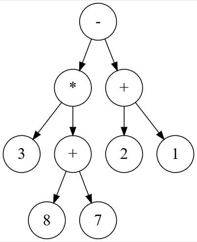

# Sujet 08

## Exercice 1

Le codage par différence (_delta encoding_ en anglais) permet de compresser un tableau
d'entiers dont les valeurs sont proches les unes des autres. Le principe est de stocker la
première donnée en indiquant pour chaque autre donnée sa différence avec la précédente
plutôt que la donnée elle-même.

On se retrouve alors avec un tableau de données plus petit, nécessitant
moins de place en mémoire. Cette méthode se révèle efficace lorsque les valeurs consécutives
sont proches.

Programmer la fonction `delta(liste)` qui prend en paramètre un tableau non vide de nombres entiers
et qui renvoie un tableau contenant les valeurs entières compressées à l'aide cette technique.

```python
def delta(a):
    pass
```

Exemples :

```python
assert delta([1000, 800, 802, 1000, 1003]) == [1000, -200, 2, 198, 3]
assert delta([42]) == [42]
```

## Exercice 2

Une expression arithmétique ne comportant que les quatre opérations +, −, ×, ÷ peut être
représentée sous forme d'arbre binaire. Les nœuds internes sont des opérateurs et les feuilles
sont des nombres. Dans un tel arbre, la disposition des nœuds joue le rôle des parenthèses que
nous connaissons bien.



En parcourant en profondeur infixe l'arbre binaire ci-dessus, on retrouve l'expression notée habituellement :

$$(3 \times (8 + 7)) − (2 + 1)$$

La classe `Expr` ci-après permet d'implémenter une structure d'arbre binaire pour représenter de telles expressions.

Compléter la méthode récursive `infixe` qui renvoie une chaîne de caractères contenant des parenthèses représentant l'expression arithmétique sur laquelle on l'applique.

```python
class Expr:
    """Classe implémentant un arbre d'expression."""

    def __init__(self, g, v, d):
        """un objet Expr possède 3 attributs :
        - gauche : la sous-expression gauche ;
        - valeur : la valeur de l'étiquette, opérande ou nombre ;
        - droite : la sous-expression droite."""
        self.gauche = g
        self.valeur = v
        self.droite = d

    def est_une_feuille(self):
        """renvoie True si et seulement
        si le noeud est une feuille"""
        return self.gauche is None and self.droite is None

    def infixe(self):
        """renvoie la représentation infixe de l'expression en
        chaine de caractères"""
        s = ...
        if self.gauche is not None:
            s = "(" + s + ....infixe()
        s = s + ...
        if ... is not None:
            s = s + ... + ...
        return s
```

Exemples :

```python
a = Expr(Expr(None, 1, None), "+", Expr(None, 2, None))
assert a.infixe() == "(1+2)"
b = Expr(
    Expr(Expr(None, 1, None), "+", Expr(None, 2, None)),
    "*",
    Expr(Expr(None, 3, None), "+", Expr(None, 4, None)),
)
assert b.infixe() == "((1+2)*(3+4))"
e = Expr(
    Expr(Expr(None, 3, None), "*", Expr(Expr(None, 8, None), "+", Expr(None, 7, None))),
    "-",
    Expr(Expr(None, 2, None), "+", Expr(None, 1, None)),
)
assert e.infixe() == "((3*(8+7))-(2+1))"
```
