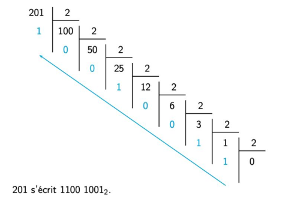

# Sujet 15

## Exercice 1

Écrire une fonction `moyenne` qui prend en paramètre un tableau non vide de nombres
flottants et qui renvoie la moyenne des valeurs du tableau. Les tableaux seront
représentés sous forme de liste Python.

```python
def moyenne(a):
    pass
```

Exemples :

```python
assert moyenne([1.0]) == 1.0
assert moyenne([1.0, 2.0, 4.0]) == 2.3333333333333335
```

## Exercice 2

On considère la fonction `binaire`.
Cette fonction prend en paramètre un entier positif `a` en
écriture décimale et renvoie son écriture binaire sous la forme d'une chaine de caractères.

L'algorithme utilise la méthode des divisions euclidiennes successives comme l'illustre
l'exemple ci-après.



Compléter le code de la fonction `binaire`.

```python
def binaire(a):
    """convertit un nombre entier a en sa representation
    binaire sous forme de chaine de caractères."""
    if a == 0:
        return ...
    bin_a = ...
    while ...:
        bin_a = ... + bin_a
        a = ...
    return bin_a
```

Exemples :

```python
assert binaire(83) == "1010011"
assert binaire(127) == "1111111"
assert binaire(0) == "0"
```
