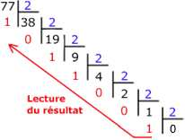

# Sujet_17
## S_17.1

Écrire une fonction Python appelée `nb_repetitions` qui prend en paramètres un
élément `elt` et un tableau `tab` (type `list`) et renvoie le nombre de fois où l'élément apparaît dans le tableau.

```python
def nb_repetitions(a):
    pass
```


Exemples :
```python
assert nb_repetitions(5, [2, 5, 3, 5, 6, 9, 5]) == 3
assert nb_repetitions("A", ["B", "A", "B", "A", "R"]) == 2
assert nb_repetitions(12, [1, 3, 7, 21, 36, 44]) == 0
```


## S_17.2

Pour rappel, la conversion d'un nombre entier positif en binaire peut s'effectuer à l'aide
des divisions successives comme illustré ici :



Voici une fonction Python basée sur la méthode des divisions successives permettant de
convertir un nombre entier positif en binaire :

Compléter la fonction ```binaire```

```python
def binaire(a):
    """convertit un nombre entier a en sa representation
    binaire sous forme de chaine de caractères."""
    if a == 0:
        return "0"
    bin_a = ...
    while ...:
        bin_a = ... + bin_a
        a = ...
    return bin_a
```

Exemples :

```python
assert binaire(0) == "0"
assert binaire(77) == "1001101"
```

