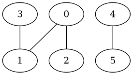

# Sujet_21
## S_21.1

Écrire une fonction `recherche_motif` qui prend en paramètre une chaîne de caractères
`motif` non vide et une chaîne de caractères `texte` et qui renvoie la liste des positions de
`motif` dans `texte`. Si `motif` n'apparaît pas, la fonction renvoie une liste vide.

```python
def recherche_motif(a, b):
    pass
```


Exemples:

```python
assert recherche_motif("ab", "") == []
assert recherche_motif("ab", "cdcdcdcd") == []
assert recherche_motif("ab", "abracadabra") == [0, 7]
assert recherche_motif("ab", "abracadabraab") == [0, 7, 11]
```

## S_21.2

Dans cet exercice, on considère un graphe non orienté représenté sous forme de listes
d'adjacence. On suppose que les sommets sont numérotés de 0 à n-1.

Ainsi, le graphe suivant:



sera représenté par la liste d'adjacence suivante:

`adj = [[1, 2], [0, 3], [0], [1], [5], [4]]`

On souhaite déterminer les sommets accessibles depuis un sommet donné dans le graphe.
Pour cela, on va procéder à un parcours en profondeur du graphe.

Compléter la fonction suivante.

>```python
>def parcours(adj, x, acc):
>    '''Réalise un parcours en profondeur récursif
>    du graphe donné par les listes d'adjacence adj 
>    depuis le sommet x en accumulant les sommets
>    rencontrés dans acc'''
>    if x ...: 
>        acc.append(x)
>        for y in ...: 
>            parcours(adj, ...) 
>
>def accessibles(adj, x):
>    '''Renvoie la liste des sommets accessibles dans le
>    graphe donné par les listes d'adjacence adj depuis
>    le sommet x.'''
>    acc = []
>    parcours(adj, ...) 
>    return acc
>
```

```python
# Votre code ici
```

Exemples :

```python
assert accessibles([[1, 2], [0], [0, 3], [1], [5], [4]], 0) == [0, 1, 2, 3]
assert accessibles([[1, 2], [0], [0, 3], [1], [5], [4]], 4) == [4, 5]
```

