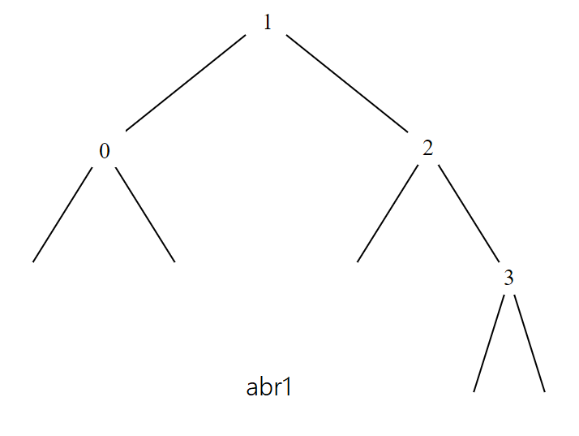

# Sujet 23

## Exercice 1

Dans cet exercice, on considère des arbres binaires de recherche qui sont :

- soit l'arbre vide identifié par `None` ;
- soit un nœud, contenant une clé et deux sous-arbres gauche et droit et représenté par un triplet `(g, v, d)` où `g` et `d` sont les sous-arbres gauche et droit et `v` la clé.



Ainsi, l'arbre binaire de recherche `abr1` ci-contre est créé par le code python ci-dessous

```python
n0 = (None, 0, None)
n3 = (None, 3, None)
n2 = (None, 2, n3)
abr1 = (n0, 1, n2)
```

Écrire une fonction récursive `insertion_abr(a, cle)` qui prend en paramètres une
clé `cle` et un arbre binaire de recherche `a`, et qui renvoie un arbre binaire de recherche
dans lequel `cle` a été insérée.
Dans le cas où `cle` est déjà présente dans `a`, la fonction renvoie l'arbre a inchangé.

```python
def insertion_abr(a, b):
    pass
```

Résultats à obtenir :

```python
n0 = (None, 0, None)
n3 = (None, 3, None)
n2 = (None, 2, n3)
abr1 = (n0, 1, n2)
assert insertion_abr(abr1, 4) == (
    (None, 0, None),
    1,
    (None, 2, (None, 3, (None, 4, None))),
)
assert insertion_abr(abr1, -5) == (
    ((None, -5, None), 0, None),
    1,
    (None, 2, (None, 3, None)),
)
assert insertion_abr(abr1, 2) == ((None, 0, None), 1, (None, 2, (None, 3, None)))
```

## Exercice 2

On dispose d'un ensemble d'objets dont on connaît, pour chacun, la masse. On souhaite ranger l'ensemble de ces objets dans des boites identiques de telle manière que la somme des masses des objets contenus dans une boîte ne dépasse pas la capacité `c` de la boîte. On souhaite utiliser le moins de boîtes possibles pour ranger cet ensemble d'objets.

Pour résoudre ce problème, on utilisera un algorithme glouton consistant à placer chacun des objets dans la première boîte où cela est possible.

Par exemple, pour ranger dans des boîtes de capacité `c = 5` un ensemble de trois objets dont les masses sont représentées en Python par la liste `[1, 5, 2]`, on procède de la façon suivante :

- Le premier objet, de masse 1, va dans une première boite.
- Le deuxième objet, de masse 5, ne peut pas aller dans la même boite que le premier objet car cela dépasserait la capacité de la boite. On place donc cet objet dans une deuxième boîte.
- Le troisième objet, de masse 2, va dans la première boîte.

On a donc utilisé deux boîtes de capacité `c = 5` pour ranger les 3 objets.

Compléter la fonction Python `empaqueter(liste_masses, c)` suivante pour qu'elle renvoie le nombre de boîtes de capacité `c` nécessaires pour empaqueter un ensemble d'objets dont les masses sont contenues dans la liste `liste_masses`.

```python
def empaqueter(liste_masses, c):
    """Renvoie le nombre minimal de boîtes nécessaires pour
    empaqueter les objets de la liste liste_masses, sachant
    que chaque boîte peut contenir au maximum c kilogrammes"""
    n = len(liste_masses)
    nb_boites = 0
    boites = [0 for _ in range(n)]
    for masse in ...:
        i = 0
        while i < nb_boites and boites[i] + ... > c:
            i = i + 1
        if i == nb_boites:
            ...
        boites[i] = ...
    return ...
```

Exemples :

```python
assert empaqueter([1, 2, 3, 4, 5], 10) == 2
assert empaqueter([1, 2, 3, 4, 5], 5) == 4
assert empaqueter([7, 6, 3, 4, 8, 5, 9, 2], 11) == 5
```
